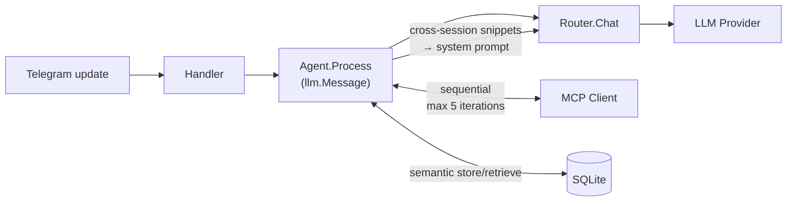

# CLAUDE.md

This file provides guidance to Claude Code (claude.ai/code) when working with code in this repository.

## Commands

```bash
make run          # load .env and run locally (go run)
make build        # compile to bin/agent
make setup        # go mod tidy
make docker-up    # start in Docker (detached)
make logs         # follow Docker logs
```

Run a single test package:
```bash
set -a && . ./.env && set +a && go test ./internal/telegram/...
```

Run all tests with race detector:
```bash
CGO_ENABLED=0 go test -race -count=1 ./...
```

Build requires no CGO — `modernc.org/sqlite` is pure Go.

## Architecture

Single binary: `cmd/agent/main.go` wires everything together.

### Request flow



### Key packages

**`internal/llm`** — LLM abstraction.
- `provider.go` — `Provider` interface + `Message`, `Tool`, `ContentPart`, `ImageURL` types
- `openai_compat.go` — shared OpenAI-compatible implementation using raw `net/http` (no go-openai). `buildMessages(messages, systemPrompt, vision bool)` serialises messages with full control: assistant messages with `tool_calls` and empty content use `"content": null` (not omitted) to satisfy all provider APIs. `image_url` parts are replaced with `[image]` for non-vision providers. Defines `APIError{StatusCode, Message}` for fallback routing.
- `router.go` — thread-safe routing config (`mu` protects both `override` and `cfg`). Priority: multimodal → override → classifier → reasoner → primary → fallback on 5xx/429/network. `SetRole(role, model)` + `SetClassifierMinLen(n)` allow runtime changes; `saveOverrides()` persists to `persistPath` (JSON) on every change; `LoadPersistedOverrides()` applies saved values on startup. Classifier has a 5 s timeout.
- All providers are optional in `main.go` — any configured model can be `routing.default`. The bot exits with a clear error if the default provider is missing.

**`internal/store`** — conversation history.
- `Store` interface → `CompactableStore` → `SemanticStore` (progressive extension interfaces)
- `Store`: `GetHistory`, `AddMessage`, `ClearHistory`
- `CompactableStore`: adds `GetAllActive`, `AddSummary`, `MarkCompacted`, `ActiveCharCount`, `GetStats`
- `SemanticStore`: adds `AddMessageWithEmbedding`, `GetSemanticHistory`, `SearchAllSessions`
- `HistorySnippet` — `{Date, UserText, BotText}` used for cross-session context injection
- SQLite: history scoped by `id > lastResetID` (is_reset=1 marker). Auto session break after 4h idle carries last summary; `/clear` resets without carry-over. `parts` column stores multimodal content as JSON. `embedding BLOB` stores float32 vectors (little-endian, 4 bytes/value).
- Memory: fallback when `data/` dir is unavailable

**`internal/mcp`** — MCP HTTP client.
- Connects on startup (`initialize` → `tools/list`). Supports JSON and SSE responses.
- Per-server tool filtering: `allowTools` (allowlist) checked after `denyTools` (blocklist)
- Auth via generic `headers` map (Claude Desktop format)
- Security: `validateServerURL` blocks loopback/link-local addresses and non-http(s) schemes; tool names validated by regex + 128-char limit; descriptions truncated to 4 KB; args size capped at 1 MB; responses capped at 10 MB via `io.LimitReader`; tool results truncated to 100 KB
- **Vector tool filtering**: `EnableEmbeddings(cfg, topK)` + `EmbedTools(ctx)` at startup; `LLMToolsForQuery(ctx, query)` returns top-K most relevant tools per request via cosine similarity
- **`EmbedText(ctx, text) ([]float32, error)`** — public method; used by agent for message embedding (shared embedding layer with tool filtering)

**`internal/mcp/embeddings.go`** — embedding provider abstraction.
- `embed(ctx, cfg, text)` dispatches by `cfg.Provider`: `"hf-tei"` → HuggingFace TEI (`POST /embed`, Basic Auth); `"openai"` → OpenAI-compatible (`POST /v1/embeddings`, Bearer); default → Gemini (`embedContent` API, `x-goog-api-key`)
- `doEmbedRequest` — shared HTTP helper with `io.LimitReader(10 MB)`
- `cosineSimilarity` — used for tool filtering; `cosineSimilarityF32` (same logic) in `store/sqlite.go` for history

**`internal/agent`** — agentic loop.
- `Process(ctx, chatID, llm.Message, onToolCall)`:
  1. Calls `storeUserMessage` — embeds user message via `mcp.EmbedText` and stores with embedding if `SemanticStore` available; falls back to plain `AddMessage`
  2. Auto-compacts if needed
  3. Calls `buildCrossSessionContext` — searches past sessions, formats snippets for system prompt (top 5, cosine > 0.75, 3000 char budget; 200/300 chars per user/bot snippet)
  4. Agentic loop: calls `getHistory` → `Router.Chat` → handles tool calls (max 5 iterations)
- `getHistory(chatID, queryEmb)` — uses `SemanticStore.GetSemanticHistory(chatID, emb, 10, 20)` when embedding available; falls back to `GetHistory`
- `GetStats(chatID) (store.ChatStats, bool)` — type-asserts store to `CompactableStore`
- `compact.go` — token-based threshold: 16 000 estimated tokens. Fast pre-check at 32 000 chars. `EstimateTokens`: `len(Content)/4` + text parts `/4` + images `×1000`

**`internal/telegram`** — Telegram Bot API handler.
- `markdown.go` — Markdown → Telegram HTML converter. No external deps.
- `handler.go`:
  - 2 s debounce batch merges text, photos (max 5), forwarded messages into one `llm.Message`
  - **Race condition fix**: `version` counter on each batch; timer bails if version changed
  - **Reply chain**: `buildReplyQuote()` prepends `[Replying to: "..."]` (max 300 chars)
  - **Graceful shutdown**: `Drain()` atomically swaps batches map, flushes synchronously
  - `/routing` — inline keyboard for live routing changes; callback `rt:set:<role>:<model>` calls `agent.SetRoutingRole`; logs `routing change requested/applied`
  - `/stats` — calls `agent.GetStats`, formats stats message
  - `NotifyMissingRouting()` — startup check; sends inline model-picker for unconfigured routing roles
  - Responses ≥ 4096 chars sent as `response.md`
  - `downloadFile` uses 30 s timeout HTTP client

### Configuration files

| File | Purpose |
|---|---|
| `.env` | Secrets: `TELEGRAM_BOT_TOKEN`, `DEEPSEEK_API_KEY`, `GEMINI_API_KEY`, `QWEN_API_KEY`, `TELEGRAM_OWNER_CHAT_ID`, `TZ` (default `Europe/Belgrade`), `EMBED_API_KEY` (optional, HF-TEI) |
| `config/config.yaml` | Models, routing, tool_filter — `${ENV_VAR}` substitution. All models require `base_url`; `embedding` is exception (no `base_url`/`max_tokens`) |
| `config/routing.json` | Runtime routing overrides from `/routing` UI — auto-created, applied over `config.yaml` at startup. **Applied before compacter init**, so effective primary is always correct. |
| `config/mcp.json` | MCP servers in Claude Desktop format |
| `config/system_prompt.md` | System prompt injected on every LLM request |

### LLM routing priority

1. **Multimodal** — message has image `Parts`
2. **Reasoner** — `/model` override, or classifier returns `yes`
3. **Primary** — default (any configured model; not hardcoded to DeepSeek)
4. **Fallback** — primary returns 5xx/429/network error

`routing.default` can be any model key defined under `models:`. The bot exits with a clear error at startup if the configured default is not available.

### Semantic memory layers

**Within-session RAG** (`SemanticStore.GetSemanticHistory`):
- User messages embedded and stored as `embedding BLOB` in SQLite
- Context = last `recentN=10` messages always + up to `topK=20` older turns ranked by cosine similarity
- Turns (user msg + assistant reply + tool calls) kept together for coherence
- Falls back to `GetHistory` (last 30) when embeddings unavailable

**Cross-session memory** (`SemanticStore.SearchAllSessions` → `agent.buildCrossSessionContext`):
- Searches all sessions (no `lastResetID` filter) for turns similar to current query
- Filters: cosine ≥ 0.75, top 5 results, 3000 char total budget
- Snippets injected into system prompt as `"Relevant context from previous conversations:"`
- Complementary to MCP personal-memory (which stores explicit facts)

### Tool filtering (vector similarity)

Configured via `tool_filter.top_k` in `config.yaml` and `models.embedding`. Same embedding model is shared with conversation memory.

- At startup: all tool descriptions embedded, cached in memory
- Per request: user message embedded → cosine similarity → top-K tools sent to LLM
- `top_k: 0` disables filtering entirely

### SQLite schema

```sql
CREATE TABLE messages (
    id           INTEGER PRIMARY KEY AUTOINCREMENT,
    chat_id      INTEGER NOT NULL,
    role         TEXT    NOT NULL,
    content      TEXT    NOT NULL,
    parts        TEXT,           -- JSON: []ContentPart for multimodal
    tool_calls   TEXT,           -- JSON: []ToolCall
    tool_call_id TEXT,
    embedding    BLOB,           -- float32 LE, user messages only
    is_summary   INTEGER DEFAULT 0,
    is_compacted INTEGER DEFAULT 0,
    is_reset     INTEGER DEFAULT 0,
    created_at   DATETIME DEFAULT CURRENT_TIMESTAMP
);
```

Migrations run at startup with `ALTER TABLE ADD COLUMN` (idempotent in SQLite). `GetHistory` returns last 30 non-compacted messages. Queries always filter `id > lastResetID`.

### CI

GitHub Actions (`.github/workflows/ci.yml`) runs `go test -race -count=1 ./...` before Docker build and push. A failed test prevents the image from being published.

### Adding a new LLM provider

1. Implement `llm.Provider` interface (or reuse `openai_compat.go` if OpenAI-compatible)
2. Add `ModelConfig` with `base_url` to `config.yaml` and `ModelsConfig` struct
3. Wire in `main.go` with `if cfg.Models.X.APIKey != "" { addProvider("key", ...) }`
4. Set as `routing.default` or a routing role

### Adding multimodal content types

`llm.Message.Parts []ContentPart` supports `"text"`, `"image_url"`. Audio (`"input_audio"`) is defined in types but not wired in the handler.

### Companion MCP servers

- [personal-memory](https://github.com/dzarlax/personal_memory) — semantic memory + Todoist, connects via `mcp.json`
- [health-dashboard](https://github.com/dzarlax/health_dashboard) — Apple Health data + MCP tools for AI analysis
