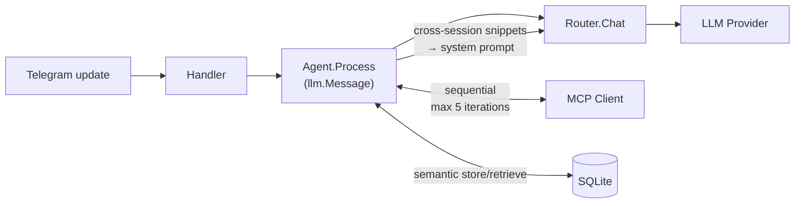

# CLAUDE.md

This file provides guidance to Claude Code (claude.ai/code) when working with code in this repository.

## Commands

```bash
make run          # load .env and run locally (go run)
make build        # compile to bin/agent
make setup        # go mod tidy
make docker-up    # start in Docker (detached)
make logs         # follow Docker logs
```

Run a single test package:
```bash
set -a && . ./.env && set +a && go test ./internal/telegram/...
```

Run all tests with race detector:
```bash
go test -race -count=1 ./...
```

Build requires no CGO — `modernc.org/sqlite` is pure Go.

## Architecture

Single binary: `cmd/agent/main.go` wires everything together.

### Request flow



### Key packages

**`internal/llm`** — LLM abstraction.
- `provider.go` — `Provider` interface + `Message`, `Tool`, `ContentPart`, `ImageURL` types
- `openai_compat.go` — shared OpenAI-compatible implementation using raw `net/http` (no go-openai). `buildMessages(messages, systemPrompt, vision bool)` serialises messages with full control: assistant messages with `tool_calls` and empty content use `"content": null` (not omitted) to satisfy all provider APIs. `image_url` parts are replaced with `[image]` for non-vision providers; `input_audio` parts likewise. Defines `APIError{StatusCode, Message}` for fallback routing.
- `ollama.go` — native Ollama provider using `/api/chat` protocol (not OpenAI-compat). Supports Ollama Cloud (`https://ollama.com`) and local instances. Handles tool calling (Ollama returns `arguments` as object → serialised to JSON string; generates `call_N` IDs since Ollama omits them). Multimodal: base64 images sent via `images[]` field (strips data URI prefix). `stream: false` for synchronous responses.
- `claude_bridge.go` — Claude Bridge provider. Sends prompts to `claude-bridge` HTTP service on the host, which wraps `claude -p` CLI. `buildPrompt(messages, systemPrompt)` flattens multi-turn history into `User: ... / Assistant: ...` text format (CLI doesn't support multi-turn). Multimodal parts replaced with `[image]`/`[audio]`/`[document]` placeholders. Returns `APIError` on bridge errors for fallback routing. No tool calling — Claude CLI handles MCP tools itself via `--project-dir`.
- `local.go` — local model provider via llama.cpp server (OpenAI-compatible API). No API key required — only `base_url` and `model`. Used for classifier routing with lightweight models like Gemma 3n 270M.
- `router.go` — thread-safe routing config (`mu` protects both `override` and `cfg`). Priority: multimodal → override → classifier → reasoner → primary → fallback on 5xx/429/network. `SetRole(role, model)` + `SetClassifierMinLen(n)` allow runtime changes; `saveOverrides()` persists to `persistPath` (JSON) on every change; `LoadPersistedOverrides()` applies saved values on startup. Classifier has 5 s timeout; input truncated to 500 chars; logs routing decisions at Info when routed to reasoner.
- All providers are optional in `main.go` — any configured model can be `routing.default`. The bot exits with a clear error if the default provider is missing.

**`internal/store`** — conversation history.
- `Store` interface → `CompactableStore` → `SemanticStore` (progressive extension interfaces)
- `Store`: `GetHistory`, `AddMessage`, `ClearHistory`
- `CompactableStore`: adds `GetAllActive`, `AddSummary`, `MarkCompacted`, `ActiveCharCount`, `GetStats`
- `SemanticStore`: adds `AddMessageWithEmbedding`, `GetSemanticHistory`, `SearchAllSessions`
- `HistorySnippet` — `{Date, UserText, BotText}` used for cross-session context injection
- SQLite: history scoped by `id > lastResetID` (is_reset=1 marker). Auto session break after 4h idle carries last summary; `/clear` resets without carry-over. `parts` column stores multimodal content as JSON. `embedding BLOB` stores float32 vectors (little-endian, 4 bytes/value).
- Memory: fallback when `data/` dir is unavailable

**`internal/mcp`** — MCP HTTP client.
- Connects on startup (`initialize` → `tools/list`). Supports JSON and SSE responses.
- Per-server tool filtering: `allowTools` (allowlist) checked after `denyTools` (blocklist)
- Auth via generic `headers` map (Claude Desktop format)
- Security: `validateServerURL` blocks loopback/link-local addresses and non-http(s) schemes; tool names validated by regex + 128-char limit; descriptions truncated to 4 KB; args size capped at 1 MB; responses capped at 10 MB via `io.LimitReader`; tool results truncated to 100 KB
- **Vector tool filtering**: `EnableEmbeddings(cfg, topK)` + `EmbedTools(ctx)` at startup; `LLMToolsForQuery(ctx, query)` returns top-K most relevant tools per request via cosine similarity
- **`EmbedText(ctx, text) ([]float32, error)`** — public method; used by agent for message embedding (shared embedding layer with tool filtering)
- **`Close()`** — releases HTTP connection pools for all MCP servers; called on shutdown

**`internal/mcp/embeddings.go`** — embedding provider abstraction.
- `embed(ctx, cfg, text)` dispatches by `cfg.Provider`: `"hf-tei"` → HuggingFace TEI (`POST /embed`, Basic Auth); `"openai"` → OpenAI-compatible (`POST /v1/embeddings`, Bearer); default → Gemini (`embedContent` API, `x-goog-api-key`)
- `doEmbedRequest` — shared HTTP helper with `io.LimitReader(10 MB)` and reusable `embedHTTPClient` (package-level singleton)
- `cosineSimilarity` — used for tool filtering; `cosineSimilarityF32` (same logic) in `store/sqlite.go` for history

**`internal/agent`** — agentic loop.
- `Process(ctx, chatID, llm.Message, onToolCall)`:
  1. Calls `storeUserMessage` — embeds user message via `mcp.EmbedText` and stores with embedding if `SemanticStore` available; falls back to plain `AddMessage`
  2. Auto-compacts if needed (with 2 min timeout)
  3. Calls `buildCrossSessionContext` — searches past sessions, formats snippets for system prompt (top 5, cosine > 0.75, 3000 char budget; 200/300 chars per user/bot snippet)
  4. Agentic loop: calls `getHistory` → `Router.Chat` → handles tool calls (max 5 iterations); tool results > 2000 chars are auto-summarised via LLM before storing in history
- `TranscribeAudio(ctx, audioData, format)` — sends audio to multimodal provider with transcription prompt; returns text. Used by handler for voice messages.
- `EnableWebSearch(cfg)` — activates built-in `web_search` tool; `callTool()` dispatches built-in tools before MCP.
- `getHistory(chatID, queryEmb)` — uses `SemanticStore.GetSemanticHistory(chatID, emb, 10, 20)` when embedding available; falls back to `GetHistory`
- `GetStats(chatID) (store.ChatStats, bool)` — type-asserts store to `CompactableStore`
- `cache.go` — `ResponseCache`: in-memory LLM response cache keyed by query embedding. `Get(chatID, emb)` returns hit if cosine ≥ 0.92 and not expired. `Set(chatID, emb, response)` stores entry; evicts expired on write, then oldest if at capacity. TTL=4h, maxSize=200. Checked before LLM call; only pure direct responses (first iteration, no tool calls) are cached.
- `websearch.go` — built-in `web_search` tool with provider dispatch. `callWebSearch(ctx, cfg, argsJSON)` routes by `cfg.Provider`: `"ollama"` (default, legacy) calls `POST /api/web_search` on Ollama Cloud; `"tavily"` calls `POST /search` on `api.tavily.com` with `search_depth: basic` (1 credit/call) and `include_answer: true` — prepends Tavily's answer summary to source list. Returns formatted results (title, URL, content snippet). Registered as `web_search` tool visible to any LLM. `callWebSearchCached` wraps the call: embeds the query, checks `webSearchCache` (global, TTL 6h, cosine ≥ 0.95, max 100 entries) before hitting the provider; stores successful results for reuse. Same cache is shared with `web_fetch`.
- `webfetch.go` — built-in `web_fetch` tool. Primary path: `fetchViaHTTP` does HTTP GET + `go-shiori/go-readability` to extract main text. Fallback: when the primary fails or returns < 200 chars AND `CDPURL` is configured, `fetchViaCDP` connects to a headless Chrome via CDP (`chromedp.NewRemoteAllocator`), navigates, grabs outer HTML, re-parses with readability. Output capped at 8000 chars. `callWebFetchCached` shares `webSearchCache` keyed by URL embedding. No external paid API — only cost is container resources.
- `compact.go` — token-based threshold: 16 000 estimated tokens. Fast pre-check at 32 000 chars. `EstimateTokens`: `len(Content)/4` + text parts `/4` + images `×1000`. **Semantic compaction**: `GetAllActive` now populates `MessageRow.Embedding`; if embeddings are present, `clusterByEmbedding` groups turns into topic clusters (greedy cosine, threshold 0.65) and each cluster is summarised separately — results joined with `---`. Falls back to single-pass when no embeddings or only one cluster.

**`internal/telegram`** — Telegram Bot API handler.
- `markdown.go` — Markdown → Telegram HTML converter. No external deps.
- `handler.go`:
  - 2 s debounce batch merges text, photos (max 5), voice messages, forwarded messages into one `llm.Message`
  - **Voice transcription**: `transcribeVoice()` downloads OGG from Telegram, calls `agent.TranscribeAudio()` (30 s timeout), result merged as text into the batch
  - **Race condition fix**: `version` counter on each batch; timer bails if version changed
  - **Reply chain**: `buildReplyQuote()` prepends `[Replying to: "..."]` (max 300 chars)
  - **Graceful shutdown**: `Drain()` atomically swaps batches map, flushes synchronously (30 s timeout in main.go)
  - **Concurrency limiter**: semaphore limits `handleUpdate` goroutines to 10 concurrent
  - **Smart forward buffer**: forward-only batch → `bufferForwards()` embeds each entry via `agent.EmbedText` and stores `[]forwardEntry{text, emb}` with 5 min TTL. On follow-up question: question is embedded, `selectForwards()` scores buffered entries by cosine similarity and keeps those ≥ 0.25 (min 2 always included). Falls back to all entries when embeddings unavailable or ≤ 3 entries buffered.
  - `/routing` — inline keyboard for live routing changes; callback `rt:set:<role>:<model>` calls `agent.SetRoutingRole`; logs `routing change requested/applied`
  - `/stats` — calls `agent.GetStats`, formats stats message
  - `NotifyMissingRouting()` — startup check; sends inline model-picker for unconfigured routing roles
  - Responses ≥ 4096 chars sent as `response.md`
  - `downloadFile` uses reusable 30 s timeout HTTP client (`downloadHTTPClient` package-level singleton)

### Configuration files

| File | Purpose |
|---|---|
| `.env` | Secrets: `TELEGRAM_BOT_TOKEN`, `DEEPSEEK_API_KEY`, `GEMINI_API_KEY`, `QWEN_API_KEY`, `OLLAMA_API_KEY` (optional), `TELEGRAM_OWNER_CHAT_ID`, `TZ` (default `Europe/Belgrade`), `EMBED_API_KEY` (optional, HF-TEI), `CLAUDE_BRIDGE_TOKEN` (optional, shared secret with claude-bridge) |
| `config/config.yaml` | Models, routing, tool_filter, web_search — `${ENV_VAR}` substitution. All models require `base_url`; `embedding` is exception (no `base_url`/`max_tokens`). `Validate()` checks required fields and numeric ranges on load. |
| `config/routing.json` | Runtime routing overrides from `/routing` UI — auto-created, applied over `config.yaml` at startup. **Applied before compacter init**, so effective primary is always correct. |
| `config/mcp.json` | MCP servers in Claude Desktop format |
| `config/system_prompt.md` | System prompt injected on every LLM request |

### System prompt layering

When editing system prompts, stay within the scope for each file:

| File | Committed | Scope |
|---|---|---|
| `config/system_prompt.md.example` | yes | Public starter — memory MCP + built-in tools (filesystem, ollama web_search) only |
| `templates/CLAUDE.md` | yes | Deployed to `/assistant_context/CLAUDE.md` — same built-ins-only scope as `.example` |
| `config/system_prompt.md` | no (`.gitignored`) | User's local working copy. Used as fallback system prompt when filesystem is disabled; otherwise `/assistant_context/CLAUDE.md` is primary. |

Do NOT add MCPs that users wire up individually (Todoist tasks, finance, calendar, health-dashboard, etc.) to the repo-committed files — those belong in per-deployment configs (e.g. `personal_ai_stack/deploy/personal_assistant/config/system_prompt.md` for Alexey's VPS).

Prompts are in English for tokenization efficiency. Response language is preserved by the explicit "Reply in the language the user writes in" rule inside the prompt itself.

### LLM routing priority

1. **Multimodal** — message has image `Parts`
2. **Reasoner** — `/model` override, or classifier returns `yes`
3. **Primary** — default (any configured model; not hardcoded to DeepSeek)
4. **Fallback** — primary returns 5xx/429/network error

`routing.default` can be any model key defined under `models:`. The bot exits with a clear error at startup if the configured default is not available.

### Semantic memory layers

**Within-session RAG** (`SemanticStore.GetSemanticHistory`):
- User messages embedded and stored as `embedding BLOB` in SQLite
- Context = last `recentN=10` messages always + up to `topK=20` older turns ranked by cosine similarity
- Turns (user msg + assistant reply + tool calls) kept together for coherence
- Falls back to `GetHistory` (last 30) when embeddings unavailable

**Cross-session memory** (`SemanticStore.SearchAllSessions` → `agent.buildCrossSessionContext`):
- Searches all sessions (no `lastResetID` filter) for turns similar to current query
- Filters: cosine ≥ 0.75, top 5 results, 3000 char total budget
- Snippets injected into system prompt as `"Relevant context from previous conversations:"`
- Complementary to MCP personal-memory (which stores explicit facts)

### Tool filtering (vector similarity)

Configured via `tool_filter.top_k` in `config.yaml` and `models.embedding`. Same embedding model is shared with conversation memory.

- At startup: all tool descriptions embedded, cached in memory
- Per request: user message embedded → cosine similarity → top-K tools sent to LLM
- `top_k: 0` disables filtering entirely

### SQLite schema

```sql
CREATE TABLE messages (
    id           INTEGER PRIMARY KEY AUTOINCREMENT,
    chat_id      INTEGER NOT NULL,
    role         TEXT    NOT NULL,
    content      TEXT    NOT NULL,
    parts        TEXT,           -- JSON: []ContentPart for multimodal
    tool_calls   TEXT,           -- JSON: []ToolCall
    tool_call_id TEXT,
    embedding    BLOB,           -- float32 LE, user messages only
    is_summary   INTEGER DEFAULT 0,
    is_compacted INTEGER DEFAULT 0,
    is_reset     INTEGER DEFAULT 0,
    created_at   DATETIME DEFAULT CURRENT_TIMESTAMP
);
```

Migrations run at startup with `ALTER TABLE ADD COLUMN` (idempotent in SQLite). `GetHistory` returns last 30 non-compacted messages. Queries always filter `id > lastResetID`.

### CI

GitHub Actions (`.github/workflows/ci.yml`) runs `go test -race -count=1 ./...` before Docker build and push. A failed test prevents the image from being published.

### Claude Bridge

`bridge/` contains a standalone Go HTTP service that runs on the host and wraps `claude -p` CLI. The bot (in Docker) calls it as any other LLM provider.

```
Bot (Docker) → POST /ask → claude-bridge (host:9900) → claude -p → response
```

- `bridge/main.go` — HTTP service: `/ask` (prompt → CLI → response), `/health`. Zero external dependencies (Go stdlib only)
- Config via env vars: `CLAUDE_BRIDGE_TOKEN`, `CLAUDE_BRIDGE_PROJECT_DIR`, `CLAUDE_BRIDGE_LISTEN` (default `127.0.0.1:9900`), `CLAUDE_BRIDGE_CLI` (default `claude`), `CLAUDE_BRIDGE_TIMEOUT` (default `120`), `CLAUDE_BRIDGE_CONCURRENCY` (default `2`)
- Bearer auth on all endpoints; semaphore limits concurrent CLI calls
- `cmd.Dir` set to project dir — CLI reads CLAUDE.md and .mcp.json from cwd
- JSON output parsing with raw text fallback; `APIError` for router fallback routing
- `scripts/init-context.sh` creates the project context directory with CLAUDE.md, settings.json, and MCP config symlink
- `scripts/setup.sh --with-claude /path` — full setup: context dir, build/download bridge binary, generate auth token

### Model config structure

`models:` in `config.yaml` is a **map** (`type ModelsConfig map[string]ModelConfig` in `internal/config/config.go`). Each entry's YAML key becomes its routing name (referenced from `routing.default`, `routing.reasoner`, etc.). The entry's `provider` field selects the backend: `openrouter`, `gemini`, `ollama`, `claude-bridge`, `local` for LLMs; `hf-tei`, `openai` for embeddings. The special key `embedding` is reserved for the MCP embedding provider and is not registered as an LLM.

`cmd/agent/main.go` iterates the map once at startup, dispatching each entry by `provider` to the matching `llm.New*` constructor. An entry with an unknown or empty `provider` is warned and skipped. This means you can define as many OpenRouter (or any other) models as you want — e.g. `workhorse`, `reasoner-or`, `cheap-or` — and wire each to a different `routing.*` role without any Go changes.

### Adding a new LLM provider backend

1. Implement `llm.Provider` (or reuse `openai_compat.go` if the upstream is OpenAI-compatible — see `NewOpenRouter` for the pattern, including `extraHeaders`/`extraBodyFields` for vendor-specific extensions)
2. Add a `case "your-provider":` arm to the dispatch switch in `cmd/agent/main.go`
3. Add model entries under `models:` in `config.yaml` with `provider: your-provider`
4. Reference the entry key from `routing.*`

### OpenRouter specifics (`internal/llm/openrouter.go`)

`NewOpenRouter` sets three extensions on every request via the generic `extraHeaders`/`extraBodyFields` mechanism added to `openAICompatProvider`:
- Headers: `HTTP-Referer` + `X-Title` (app attribution; improves rate-limit standing)
- `usage.include: true` (returns token counts in the response)
- `provider.require_parameters: true` + `allow_fallbacks: true` (only routes to upstream providers that support the request's params — including tool calling — and transparently retries on another upstream if the first fails)

To target a specific OpenRouter model per routing role, add multiple entries with `provider: openrouter` and different `model:` values; each becomes a provider key in main.go.

### Model capabilities (`internal/llm/capabilities.go`)

`Capabilities{Vision, Tools, Reasoning, PromptPrice, CompletionPrice, ContextLength}` describes what a specific model id supports and what it costs. Two interfaces plug into this:
- `CapabilityProvider` — optional method `Capabilities() Capabilities` on an LLM provider. The router calls `supportsVision(p)` which type-asserts to `VisionProvider` (a subset); when an OR-backed provider's caps are populated, its `vision` flag reflects `caps.Vision` and the existing routing logic picks the multimodal fallback automatically.
- `ConfigurableProvider` — optional methods `SetModel(id, caps)` + `CurrentModel()`. `openAICompatProvider` implements both; `SetModel` atomically swaps the model id, caps, and derived vision flag under `p.mu`. Used by the admin UI (Phase 2) for runtime model swaps.

`FetchOpenRouterModels(ctx, apiKey)` hits `GET https://openrouter.ai/api/v1/models` and parses each model's `architecture.input_modalities`, `supported_parameters`, `pricing`, and `context_length`. Prices are normalised from USD/token to USD/million tokens.

Persistence: the SQLite and Postgres stores each implement `llm.CapabilityStore` with methods `GetCapabilities` / `PutCapabilities` / `GetAllCapabilities` against a `model_capabilities` table (primary key `(provider, model_id)`). The Postgres `migrate()` runs `CREATE TABLE IF NOT EXISTS` at connect time; SQLite inlines it in `sqliteSchema`. Run `go test -run Capabilities ./...` to exercise both the parser and the store.

### Startup capability hydration

`hydrateOpenRouterCapabilities` in `cmd/agent/main.go` runs once right after store init and before routing-override load:
1. Picks the first OR-backed `cfg.Models` entry with an API key
2. Calls `FetchOpenRouterModels` (30s timeout)
3. On success — upserts every returned entry into `CapabilityStore`
4. On failure — falls back to whatever `GetAllCapabilities("openrouter")` returns from the store
5. For each `cfg.Models` entry with `provider: openrouter`, calls `cp.SetModel(currentModel, caps)` on its provider so the router sees accurate vision/tool flags from the very first request

### Runtime model swaps

Admin UI flow (Phase 2, not built yet): `Router.SetProviderModel(slot, modelID, caps)` → the router type-asserts `providers[slot]` to `ConfigurableProvider`, calls `SetModel`, then `saveOverrides()` writes the current OR model per slot into the settings store under `openrouter_models: {slot: model_id}`. On startup, `Router.TakePendingOpenRouterOverrides()` returns the loaded map which `applyOpenRouterOverrides` in main.go re-applies with caps from the capability store. Unknown model ids persist with zero caps (safer default — vision-aware routing treats them as text-only).

### Admin web UI (`internal/adminapi`)

Optional HTTP server on `:8087` (via `AdminAPIConfig`) serving a single-page htmx-driven UI for browsing OpenRouter models and editing routing. Wired from `main.go` only when `cfg.AdminAPI.Enabled`. Shares the router and `CapabilityStore` with the rest of the bot — no separate process.

Files:
- `server.go` — `Server` type + `registerRoutes` mux + lifecycle (`Start`/`Shutdown`)
- `auth.go` — `requireAuth` middleware: Authentik forward-auth header → cookie → bearer → 401. Bootstrap via `?token=...` sets a `admin_auth` cookie and redirects
- `handlers.go` — request handlers + data builders (`buildIndexData`, `buildRouting`, `openRouterSlots`)
- `templates.go` — `html/template` parsed at init from `templates/*.html` via `embed.FS`; exposes `render(w, view, data)`
- `templates/` — `index.html` (full page), `routing.html` / `models_table.html` (htmx partials), `partials_*.html` (shared blocks)
- `static/` — placeholders committed to unblock `go build`; real `dzarlax.css/js` and `htmx.min.js` are downloaded into this dir at Docker build time via `Dockerfile` ARGs (`DS_VERSION`, `HTMX_VERSION`, `ASSETS_CACHEBUST`). CI passes `ASSETS_CACHEBUST=${github.sha}` so every image ships with a fresh design system `@main`.

Routes:
- `GET /` — full page (routing + model table)
- `GET /models?q=&free=&vision=&tools=&reasoning=` — htmx partial: filtered `<tbody>` for `#models-tbody`
- `GET /routing` — htmx partial: routing card
- `POST /slots/<slot>/assign` (form: `model_id=...`) — `Router.SetProviderModel` with caps from the store; returns refreshed `routing` partial
- `POST /routing/<role>/set` (form: `slot=...`) — `Router.SetRole` (maps `default` → `primary`); returns refreshed `routing` partial
- `POST /refresh` — `llm.FetchOpenRouterModels` + upsert; returns refreshed `models_tbody` partial
- `GET /healthz` — unauthenticated liveness probe

The admin API never imports the Authentik library — it only _trusts_ the forwarded header. All actual authentication happens upstream in Traefik via the `authentik-auth` middleware. When running without authentik (local dev), the bearer token flow is the default.

### Persistent settings (`kv_settings`)

`llm.SettingsStore` is a generic key-value interface (`GetSetting` / `PutSetting`) backed by a `kv_settings (key PK, value, updated_at)` table in both SQLite and Postgres. Router stores routing overrides here under the `routing.overrides` key as a JSON blob.

**Legacy migration:** `Router.SetPersistPath("config/routing.json")` still wires up the old file path. On first start, `LoadPersistedOverrides` imports the file into the settings store and deletes it; subsequent starts read only from the store. The file path can be removed from deployments after the first successful run, but leaving it is harmless.

### Adding multimodal content types

`llm.Message.Parts []ContentPart` supports `"text"`, `"image_url"`, `"input_audio"`. Audio is used for voice message transcription (Telegram OGG → Gemini `input_audio`). Non-vision providers replace `image_url` with `[image]` and `input_audio` with `[audio]` text placeholders.

### Companion MCP servers

- [personal-memory](https://github.com/dzarlax/personal_memory) — semantic memory + Todoist, connects via `mcp.json`
- [health-dashboard](https://github.com/dzarlax/health_dashboard) — Apple Health data + MCP tools for AI analysis
