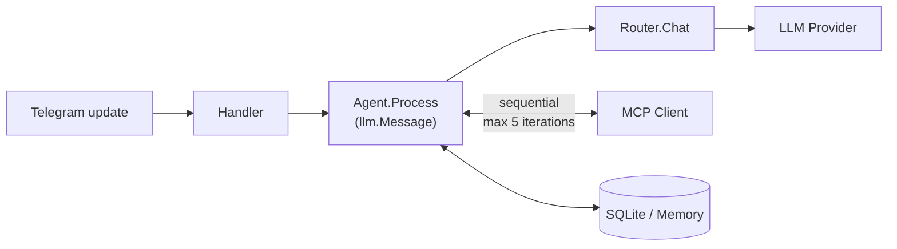

# CLAUDE.md

This file provides guidance to Claude Code (claude.ai/code) when working with code in this repository.

## Commands

```bash
make run          # load .env and run locally (go run)
make build        # compile to bin/agent
make setup        # go mod tidy
make docker-up    # start in Docker (detached)
make logs         # follow Docker logs
```

Run a single test:
```bash
set -a && . ./.env && set +a && go test ./internal/telegram/...
```

Build requires no CGO — `modernc.org/sqlite` is pure Go.

## Architecture

Single binary: `cmd/agent/main.go` wires everything together.

### Request flow



### Key packages

**`internal/llm`** — LLM abstraction.
- `provider.go` — `Provider` interface + `Message`, `Tool`, `ContentPart`, `ImageURL` types
- `openai_compat.go` — shared OpenAI-compatible implementation; `buildMessages(messages, systemPrompt, vision bool)` handles text (`Content`) and multimodal (`Parts`). When `vision=false` (all providers except multimodal Gemini), `image_url` parts in history are replaced with `[image]` to avoid 400 errors from non-vision models.
- `router.go` — picks provider: multimodal (if Parts present) → reasoner (keyword/override) → primary → fallback on 5xx/429/network
- All providers require `base_url` in config (no hardcoded defaults)

**`internal/store`** — conversation history.
- `Store` interface + `CompactableStore` extension (SQLite only)
- SQLite: history scoped by `id > lastResetID` (is_reset=1 marker). Auto session break after 4h idle carries last summary; `/clear` resets without carry-over. `parts` column stores multimodal content as JSON.
- Memory: fallback when `data/` dir is unavailable

**`internal/mcp`** — MCP HTTP client.
- Connects on startup (`initialize` → `tools/list`). Supports JSON and SSE responses.
- Per-server tool filtering: `allowTools` (allowlist) checked after `denyTools` (blocklist)
- Auth via generic `headers` map (Claude Desktop format)
- **Vector tool filtering**: `EnableEmbeddings(apiKey, model, topK)` + `EmbedTools(ctx)` at startup computes Gemini embeddings for all tools; `LLMToolsForQuery(ctx, query)` returns top-K most relevant tools per request via cosine similarity. Falls back to all tools if embeddings unavailable or query is empty.

**`internal/agent`** — agentic loop.
- `Process(ctx, chatID, llm.Message, onToolCall)` — prepends `"Current date and time: ..."` to the system prompt on every call using `time.Now()` (respects `TZ` env var set in Docker)
- `compact.go` — triggered at 60K chars; snaps boundary to user message; marks old rows `is_compacted=1`, inserts summary as `is_summary=1`

**`internal/telegram`** — Telegram Bot API handler.
- `markdown.go` — Markdown → Telegram HTML converter (headers, bold, italic, code blocks, links, lists). No external deps.
- `handler.go` — all non-command messages go through a 2 s debounce batch (`queueMessage` → `processBatch`). The batch merges text, photos, and forwarded messages into a single `llm.Message` before calling `executeMessage`. Forwarded-only batches are stored in `forwardBuf` (5 min TTL) and acknowledged with `✓`; the next regular message consumes the buffer. Hidden hyperlinks (`text_link` entities) are appended as plain URLs.
- `executeMessage` — shared processing path: typing loop, live tool-call status (edited message), `agent.Process`, response send.
- Responses ≥ 4096 chars sent as `response.md` attachment.

### Configuration files

| File | Purpose |
|---|---|
| `.env` | Secrets: `TELEGRAM_BOT_TOKEN`, `DEEPSEEK_API_KEY`, `GEMINI_API_KEY`, `TELEGRAM_OWNER_CHAT_ID`, `TZ` (default `Europe/Belgrade`) — auto-loaded by Docker Compose from project root |
| `config/config.yaml` | Models (all require `base_url`; `embedding` model is exception — no `base_url`/`max_tokens`), routing, tool_filter, Telegram IDs — `${ENV_VAR}` substitution |
| `config/mcp.json` | MCP servers in Claude Desktop format — `allowTools`, `denyTools` per server |
| `config/system_prompt.md` | System prompt injected on every LLM request |

Paths are hardcoded in `main.go` as `config/config.yaml`, `config/system_prompt.md`, `config/mcp.json`. Docker Compose mounts `./config:/app/config:ro` and passes secrets via `environment:` using `${VAR}` from `.env`.

### LLM routing priority

1. **Multimodal** (Gemini 3 Flash Preview) — message has image `Parts`
2. **Reasoner** (DeepSeek Reasoner) — `/model reasoner` or keyword in message
3. **Primary** (DeepSeek Chat) — default
4. **Fallback** (Gemini 3.1 Flash Lite) — primary returns 5xx/429/network error

### Tool filtering (vector similarity)

Configured via `tool_filter.top_k` in `config.yaml` and `models.embedding` (Gemini `gemini-embedding-001`).

- At startup: embeddings computed for all tools (`name + ": " + description`) and cached in memory
- Per request: user message embedded → cosine similarity → top-K tools sent to LLM
- Fallback to all tools if: embeddings not ready, `top_k=0`, `top_k >= total tools`, or embed API error
- `top_k: 0` disables filtering entirely

### SQLite schema notes

Flag columns: `is_reset`, `is_compacted`, `is_summary`, `parts` (JSON). Queries always filter by `id > lastResetID`. `GetHistory` returns last 30 non-compacted messages. `ALTER TABLE ADD COLUMN parts` runs at startup for migration of existing DBs.

### Adding a new LLM provider

1. Implement `llm.Provider` interface (or reuse `openai_compat.go` if OpenAI-compatible)
2. Add `ModelConfig` with `base_url` to `config.yaml` and `ModelsConfig` struct
3. Wire in `main.go`, pass to `llm.NewRouter`

### Adding multimodal content types

`llm.Message.Parts []ContentPart` supports `"text"`, `"image_url"`. Audio (`"input_audio"`) is defined in types but not wired in the handler — go-openai doesn't support it, would require raw HTTP.
