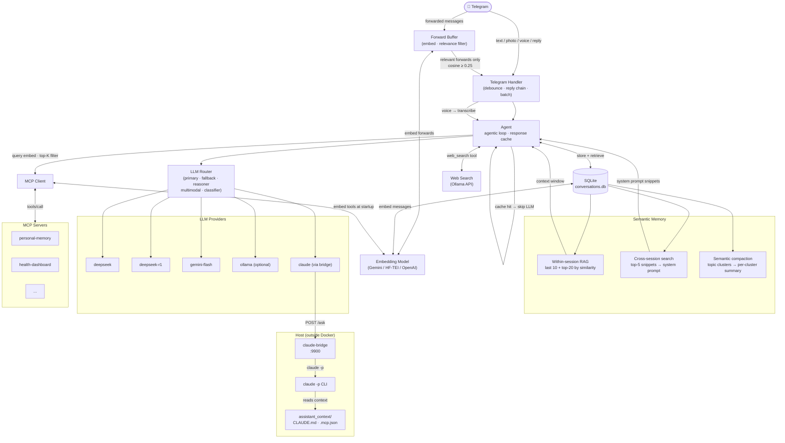

# Personal AI Agent

A lightweight Telegram bot that acts as a personal AI assistant. Written in Go — runs on a NAS, Raspberry Pi, or any small server. Bring your own API keys, no subscriptions.

## Features

- **Multi-model routing** — any configured model can be primary; automatic fallback on errors or rate limits; dedicated reasoner for complex tasks; vision model for images; classifier-based routing to reasoner
- **Claude via bridge** — use Claude (Anthropic Max subscription) as a provider through a lightweight host-side bridge service that wraps `claude -p` CLI; no separate API key needed
- **Ollama Cloud support** — native `/api/chat` provider for Ollama Cloud and local Ollama instances; tool calling, multimodal, Bearer auth
- **Voice messages** — send a voice message in Telegram and it's automatically transcribed via the multimodal model (Gemini), then processed as text through the normal pipeline
- **Web search** — built-in Ollama web search tool; any LLM model can search the web for real-time information
- **Semantic conversation memory** — user messages are embedded and stored; within a session, relevant past turns are retrieved by cosine similarity instead of just "last N messages"
- **Cross-session memory** — past conversations are searched across all sessions; relevant snippets are automatically injected into the system prompt so the bot remembers what you discussed weeks ago
- **Image support** — send a photo (with or without caption) and it's routed automatically to the vision model
- **Reply context** — replying to a bot message or your own message prepends the quoted text so the LLM has full context
- **Forwarded messages** — forward any message (text, photo, link) to the bot, then ask your question; messages arriving within 2 s are batched automatically; when embeddings are configured and more than 3 messages are buffered, only the forwards most relevant to your question (cosine ≥ 0.25) are included — irrelevant topic noise is filtered out automatically
- **Link extraction** — hidden hyperlinks (`text_link` entities) in forwarded messages are surfaced as plain URLs for the LLM
- **MCP tool support** — connects to any MCP-compatible server (HTTP/SSE), same `mcp.json` format as Claude Desktop; per-server `allowTools`/`denyTools` filtering; vector similarity filtering selects only the most relevant tools per request
- **Configurable embeddings** — shared embedding layer used for both tool filtering and conversation memory; supports Gemini (default), HuggingFace TEI, or any OpenAI-compatible endpoint
- **Persistent memory** — SQLite-backed conversation history with automatic session management
- **Token-based compaction** — auto-summarises old history when estimated token count exceeds threshold; images count as 1000 tokens each
- **Smart token usage** — classifier input truncated to 500 chars; large tool results (>2 KB) auto-summarised before entering history; response cache with cosine ≥ 0.92 threshold and 4-hour TTL
- **Rich formatting** — Markdown converted to Telegram HTML; responses ≥ 4096 chars sent as `response.md`
- **Access control** — allowlist by chat ID + owner-only enforcement
- **Date/time awareness** — current date and time injected into every request; timezone set via `TZ` env var
- **Conversation stats** — `/stats` shows message count, character count, last compaction, and last activity

## Requirements

- Go 1.24+ (or Docker)
- [Telegram Bot Token](https://t.me/BotFather)
- At least one LLM API key (DeepSeek, Gemini, or Ollama Cloud)

## Quick start

### Development (with source)

```bash
git clone https://github.com/dzarlax/personal_assistant.git
cd personal_assistant

# Setup configs from examples, create data dir
./scripts/setup.sh

# Fill in your API keys and Telegram token
nano .env

# Start
make docker-up
make logs
```

### Production server (no source code)

```bash
mkdir -p ~/personal_assistant/{config,data,bridge}
cd ~/personal_assistant

# Download docker-compose and example configs
REPO="https://raw.githubusercontent.com/dzarlax/personal_assistant/main"
curl -sLO "$REPO/docker-compose.yml"
curl -sL "$REPO/.env.example" -o .env
curl -sL "$REPO/config/config.yaml.example" -o config/config.yaml
curl -sL "$REPO/config/mcp.json.example" -o config/mcp.json
curl -sL "$REPO/config/system_prompt.md.example" -o config/system_prompt.md
curl -sL "$REPO/bridge/update.sh" -o bridge/update.sh && chmod +x bridge/update.sh

# Fill in your API keys and Telegram token
nano .env
nano config/config.yaml

# Start
docker compose up -d
```

**Get your Telegram chat ID:** send `/start` to [@userinfobot](https://t.me/userinfobot).

### With Claude Bridge (optional)

Use Claude (Anthropic Max/Pro subscription) as an LLM provider via a host-side bridge service. Activated on demand via `/claude` command in the bot.

**Prerequisites:** [Claude Code CLI](https://docs.anthropic.com/en/docs/claude-code) installed and logged in on the host.

```bash
# 1. Run setup (creates context dir, builds/downloads bridge, generates token)
./scripts/setup.sh --with-claude /path/to/assistant_context

# 2. Edit .env — fill in API keys, verify CLAUDE_BRIDGE_TOKEN and PROJECT_DIR.
nano .env

# 3. Edit config/mcp.json — add your MCP servers with "type": "http" field.
#    Required for Claude Code to recognize HTTP-based MCP servers.
nano config/mcp.json

# 4. Install systemd service (production)
sudo cp bridge/claude-bridge.service /etc/systemd/system/
sudo systemctl daemon-reload
sudo systemctl enable --now claude-bridge

# 5. Start bot
make docker-up
```

#### Updating the bridge

A pre-built binary is published to GitHub Releases on every push to `main` that changes `bridge/`. To update:

```bash
./bridge/update.sh
```

This downloads the latest binary and restarts the systemd service.

## Running

```bash
make run          # local (loads .env, runs go)
make docker-up    # Docker (copies missing example configs, starts)
make logs         # follow Docker logs
```

Data is stored in `./data/conversations.db` (mounted as a volume in Docker).

## Project layout

```
.env                   # secrets — not in git
.env.example           # template
config/
  config.yaml          # model and routing config
  system_prompt.md     # personalise the assistant here
  mcp.json             # MCP servers — not in git
  mcp.json.example     # template
  routing.json         # runtime routing overrides — auto-created
data/                  # SQLite DB — not in git
bridge/                # claude-bridge host service (optional)
  main.go              # HTTP → claude -p wrapper (config via env vars)
scripts/
  init-context.sh      # creates assistant_context directory
templates/
  CLAUDE.md            # system context template for Claude sessions
  settings.json        # permissions template for Claude CLI
```

## Configuration

### `config/config.yaml`

All values support `${ENV_VAR}` substitution. Every model requires an explicit `base_url`. Any model can be set as `routing.default` — it is not hardcoded to a specific provider.

```yaml
telegram:
  bot_token: ${TELEGRAM_BOT_TOKEN}
  allowed_chat_ids:
    - ${TELEGRAM_OWNER_CHAT_ID}
  owner_chat_id: ${TELEGRAM_OWNER_CHAT_ID}

models:
  deepseek:
    provider: deepseek
    model: deepseek-chat
    api_key: ${DEEPSEEK_API_KEY}
    max_tokens: 4096
    base_url: https://api.deepseek.com
  deepseek-r1:
    provider: deepseek
    model: deepseek-reasoner
    api_key: ${DEEPSEEK_API_KEY}
    max_tokens: 8192
    base_url: https://api.deepseek.com
  gemini-flash:
    provider: gemini
    model: gemini-3-flash-preview
    api_key: ${GEMINI_API_KEY}
    max_tokens: 4096
    base_url: https://generativelanguage.googleapis.com/v1beta/openai/

  # Embedding model — used for both MCP tool filtering and conversation memory.
  # Option 1: Gemini (default)
  embedding:
    provider: gemini
    model: gemini-embedding-001
    api_key: ${GEMINI_API_KEY}
  # Option 2: HuggingFace Text Embeddings Inference
  # embedding:
  #   provider: hf-tei
  #   base_url: https://embed.yourdomain.com
  #   api_key: ${EMBED_API_KEY}   # "user:password" for Basic Auth
  # Option 3: OpenAI-compatible endpoint
  # embedding:
  #   provider: openai
  #   base_url: https://api.openai.com
  #   model: text-embedding-3-small
  #   api_key: ${OPENAI_API_KEY}

  # Ollama Cloud or local Ollama (native /api/chat protocol)
  # ollama:
  #   model: qwen3.5:32b          # any model from ollama.com/search?c=cloud
  #   api_key: ${OLLAMA_API_KEY}  # required for cloud; optional for local
  #   base_url: https://ollama.com # default; http://localhost:11434 for local

  # Claude via bridge (requires claude-bridge running on host — see Claude Bridge section)
  # claude:
  #   base_url: http://host.docker.internal:9900
  #   api_key: ${CLAUDE_BRIDGE_TOKEN}
  #   max_tokens: 120              # timeout in seconds

routing:
  default: deepseek          # primary model — can be any configured model name
  fallback: gemini-flash     # also used for multimodal
  multimodal: gemini-flash
  reasoner: deepseek-r1
  classifier: deepseek       # model for reasoning detection; omit to disable
  classifier_min_length: 100 # min chars to run classifier; 0 = disabled
  compaction_model: deepseek

tool_filter:
  top_k: 20   # top-K tools selected per request via vector similarity; 0 = disabled

# Ollama web search — gives any LLM access to real-time web results
# web_search:
#   enabled: true
#   api_key: ${OLLAMA_API_KEY}
#   base_url: https://ollama.com  # default
```

### `config/mcp.json`

Same format as Claude Desktop. Supports custom headers for auth and per-server tool filtering.

```json
{
  "mcpServers": {
    "my-server": {
      "url": "${SERVER_URL}",
      "headers": {
        "Authorization": "Bearer ${TOKEN}"
      },
      "denyTools": ["dangerous_tool"],
      "allowTools": []
    }
  }
}
```

- `denyTools` — block specific tools, allow the rest
- `allowTools` — allow only listed tools, block the rest
- Omit both to allow all tools from the server

### `config/system_prompt.md`

Plain text or Markdown injected as system prompt on every request.

## Bot Commands

| Command | Description |
|---|---|
| `/clear` | Reset conversation context |
| `/compact` | Summarise and compress history manually |
| `/stats` | Show conversation stats (messages, chars, last compaction) |
| `/model` | Show current model |
| `/model list` | List all available models |
| `/model <name>` | Switch to a specific model for the session (e.g. `/model deepseek-r1`) |
| `/model reset` | Back to auto-routing |
| `/claude <question>` | Enter Claude mode — sends question via Claude Bridge |
| `/exit` | Exit Claude mode, back to auto-routing |
| `/routing` | Configure routing roles permanently via inline keyboard |
| `/tools` | List connected MCP tools grouped by server |
| `/help` | Show help |

> **Note:** `/model` is a temporary session override — it resets on restart. To permanently change the primary model use `/routing` or edit `config/config.yaml`.

## LLM Routing

| Priority | Role | When |
|---|---|---|
| 1 | `multimodal` | Message contains an image or audio (voice transcription) |
| 2 | `reasoner` | `/model <name>` override, or classifier detects complex reasoning |
| 3 | `primary` | Default for all other messages |
| 4 | `fallback` | Primary unavailable (5xx / 429 / network error) |

The classifier is a lightweight call with no history and no tools that returns `yes`/`no`. It only runs for messages longer than `classifier_min_length` characters (default: 100). Input is truncated to 500 chars to save tokens. Set `classifier_min_length: 0` to disable.

All routing roles can be changed live via `/routing` — an inline keyboard menu. **Changes persist across restarts** in `config/routing.json`. On startup, the bot notifies the owner via Telegram if any routing role references an unavailable model.

## Semantic Memory

When an embedding model is configured, the bot gains two levels of long-term memory beyond the current session:

### Within-session RAG
User messages are embedded and stored in SQLite. Instead of always taking the last 30 messages, the context window is built as:
- **Last 10 messages** — always included (recent context)
- **Up to 20 older turns** — selected by cosine similarity to the current query

Conversational turns (user message + assistant response + tool calls) are kept together to preserve coherence.

### Cross-session memory
On each request, past sessions are searched for semantically similar conversations. Up to 5 relevant snippets (cosine similarity > 0.75) are injected into the system prompt:

```
---
Relevant context from previous conversations:
[2026-01-15] You: what did we decide about the database?
Assistant: We decided to stay with SQLite for simplicity...
```

Each snippet is truncated (200 chars user / 300 chars assistant) with a 3000-char total budget, so it never bloats the prompt.

This is complementary to the [personal-memory](https://github.com/dzarlax/personal_memory) MCP server: personal-memory stores explicit facts you choose to remember; cross-session RAG surfaces actual conversation fragments automatically.

## Session Management

- History persists across restarts (SQLite)
- After **4 hours of inactivity**, a new session starts automatically — the last summary is carried over
- `/clear` does a full reset with no carry-over
- Compaction triggers when estimated token count exceeds **16 000 tokens** (images count as 1000 tokens each)
- When embeddings are configured, old messages are **clustered by topic** (cosine similarity < 0.65 starts a new cluster) and each cluster is summarised separately — producing a more structured, topic-aware summary. Falls back to single-pass summarisation when embeddings are unavailable

## Claude Bridge (optional)

Use Claude from your Anthropic Max/Pro subscription as an LLM provider — no separate API key needed. A lightweight Go service runs on the host and wraps `claude -p` CLI. Activated on demand via `/claude` command.

```
/claude <question> → Bot (Docker) → POST /ask → claude-bridge (host:9900) → claude -p → response
```

### How it works

- Bridge runs on the **host** (not in Docker) as a systemd service — it needs access to `claude` CLI
- Bot in Docker reaches the bridge via `host.docker.internal:9900`
- Bridge listens on the Docker bridge network (`172.17.0.1:9900`) — not exposed externally
- Each request: bot formats conversation history into a single text prompt → `claude -p` → response
- Claude CLI reads `CLAUDE.md` and `.mcp.json` from the project context directory
- MCP servers in `config/mcp.json` must have `"type": "http"` for Claude Code compatibility (bot ignores this field)

### Server setup

No source code on the server — only the binary, config, and docker-compose:

```
~/personal_assistant/
├── .env                      # secrets
├── docker-compose.yml        # bot (Docker)
├── bridge/
│   ├── claude-bridge         # binary (managed by systemd)
│   └── update.sh             # update script
├── config/
│   ├── config.yaml           # models and routing
│   ├── routing.json          # runtime routing overrides
│   ├── mcp.json              # MCP servers
│   └── system_prompt.md      # system prompt
└── data/
    └── routing.json          # runtime state
```

#### systemd service

```ini
# /etc/systemd/system/claude-bridge.service
[Unit]
Description=Claude Bridge - HTTP wrapper for Claude Code CLI
After=network.target

[Service]
Type=simple
ExecStart=/root/personal_assistant/bridge/claude-bridge
Environment=CLAUDE_BRIDGE_TOKEN=<your-token>
Environment=CLAUDE_BRIDGE_PROJECT_DIR=/root/vol/assistant_context
Environment=CLAUDE_BRIDGE_LISTEN=172.17.0.1:9900
Environment=CLAUDE_BRIDGE_CLI=/root/.local/bin/claude
Environment=CLAUDE_BRIDGE_CONCURRENCY=1
Environment=CLAUDE_BRIDGE_TIMEOUT=120
Environment=PATH=/root/.local/bin:/usr/local/bin:/usr/bin:/bin
Restart=always
RestartSec=5

[Install]
WantedBy=multi-user.target
```

```bash
sudo systemctl daemon-reload
sudo systemctl enable --now claude-bridge
```

#### Updating the bridge binary

```bash
~/personal_assistant/bridge/update.sh
```

Downloads the latest binary from GitHub Releases and restarts the service.

### Key env vars

| Variable | Required | Default | Description |
|----------|----------|---------|-------------|
| `CLAUDE_BRIDGE_TOKEN` | Yes | — | Shared secret (Bearer auth) |
| `CLAUDE_BRIDGE_PROJECT_DIR` | Yes | — | Path to project context directory |
| `CLAUDE_BRIDGE_LISTEN` | No | `127.0.0.1:9900` | Set to `172.17.0.1:9900` for Docker access |
| `CLAUDE_BRIDGE_TIMEOUT` | No | `120` | Default CLI timeout in seconds |
| `CLAUDE_BRIDGE_CONCURRENCY` | No | `1` | Max parallel CLI calls |
| `CLAUDE_BRIDGE_CLI` | No | `claude` | Path to CLI binary |

### Limitations

- ~5-8s per request (CLI cold start on each call)
- No streaming — user waits for full response
- No images — multimodal queries routed to Gemini
- Stateless — conversation history formatted into prompt by the bot

## Companion MCP Servers

This bot is designed to work with self-hosted MCP servers. Two ready-made servers are available:

| Server | Description |
|---|---|
| [personal-memory](https://github.com/dzarlax/personal_memory) | Semantic long-term memory with vector embeddings + Todoist integration |
| [health-dashboard](https://github.com/dzarlax/health_dashboard) | Health data from Apple Health (via Health Auto Export) with MCP tools for AI analysis |

Configure them in `config/mcp.json`.

## Architecture



See [CLAUDE.md](CLAUDE.md) for developer details.
