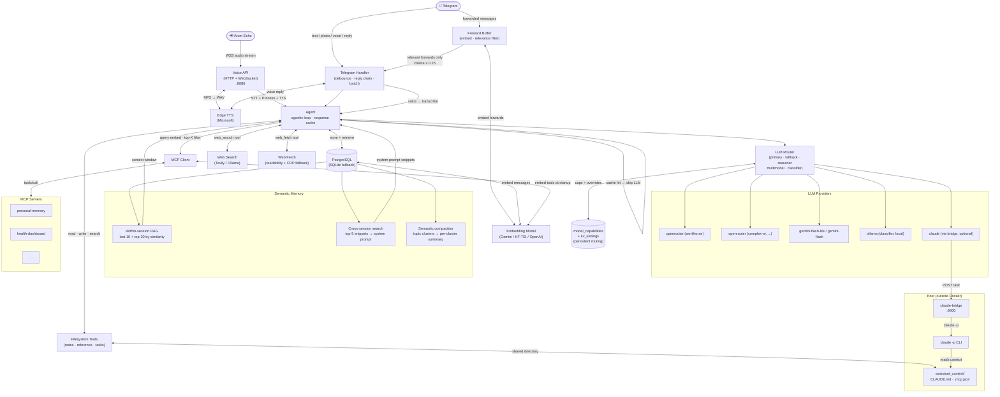

# Personal AI Agent

A lightweight Telegram bot that acts as a personal AI assistant. Written in Go — runs on a NAS, Raspberry Pi, or any small server. Bring your own API keys, no subscriptions.

## Features

- **Multi-model routing** — any configured model can be primary; automatic fallback on errors or rate limits; dedicated reasoner for complex tasks; vision model for images; classifier-based routing to reasoner (supports local models via llama.cpp server)
- **OpenRouter-centric** — cloud LLMs (DeepSeek, Qwen, Claude, Gemini, Llama, and 300+ more) accessed through a single OpenRouter API key with app-attribution headers, per-upstream retries, and tool-call-aware provider selection. Define as many named OpenRouter slots as you want and assign each to a different routing role.
- **Vision- and tool-aware routing** — model capabilities (vision, tool calling, reasoning, prices, context length) are fetched from OpenRouter's `/api/v1/models` at startup, cached in the database, and used by the router to pick the right model per request. Vision-required messages automatically fall through to a capable model.
- **Runtime model swaps** — change the model id backing any OpenRouter slot without restarting or editing YAML. Selections persist in a DB-backed settings store (`kv_settings` table), survive restarts, and sync across local Ollama + Claude bridge untouched.
- **Claude via bridge** — use Claude (Anthropic Max subscription) as a provider through a lightweight host-side bridge service that wraps `claude -p` CLI; no separate API key needed
- **Local Ollama** — native `/api/chat` provider for local Ollama instances (typically used as the cheap/fast classifier via small models like Qwen 3 0.6B on host GPU)
- **Voice messages** — send a voice message in Telegram and it's automatically transcribed via the multimodal model (Gemini), then processed as text through the normal pipeline; replies include both text and a voice message via Edge TTS
- **Voice API + Atom Echo** — HTTP and WebSocket voice API for hardware voice assistants; ships with ESPHome firmware for M5Stack Atom Echo (push-to-talk, LED feedback, streaming audio over WebSocket)
- **Text-to-speech** — Edge TTS (Microsoft) integration: no API key, high quality Russian/English voices, MP3 output for Telegram, WAV for hardware devices
- **Web search** — built-in `web_search` tool with provider dispatch: Tavily (free 1000/mo, LLM-ready answer + sources) or legacy Ollama Cloud; embedding-based query cache dedupes repeats across 6 hours
- **Web fetch** — built-in `web_fetch` tool that extracts main article text from a URL; HTTP + go-readability primary path, headless Chrome (CDP) fallback for JS-heavy or bot-protected pages
- **Filesystem tools** — built-in `fs_list`, `fs_read`, `fs_write`, `fs_append`, `fs_delete`, `fs_search` scoped to a configurable directory; path traversal protection; great for personal notes, reference materials, and shared context with Claude Bridge
- **Semantic conversation memory** — user messages are embedded and stored; within a session, relevant past turns are retrieved by cosine similarity instead of just "last N messages"
- **Cross-session memory** — past conversations are searched across all sessions; relevant snippets are automatically injected into the system prompt so the bot remembers what you discussed weeks ago
- **Image support** — send a photo (with or without caption) and it's routed automatically to the vision model
- **Reply context** — replying to a bot message or your own message prepends the quoted text so the LLM has full context
- **Forwarded messages** — forward any message (text, photo, link) to the bot, then ask your question; messages arriving within 2 s are batched automatically; when embeddings are configured and more than 3 messages are buffered, only the forwards most relevant to your question (cosine ≥ 0.25) are included — irrelevant topic noise is filtered out automatically
- **Link extraction** — hidden hyperlinks (`text_link` entities) in forwarded messages are surfaced as plain URLs for the LLM
- **MCP tool support** — connects to any MCP-compatible server (HTTP/SSE), same `mcp.json` format as Claude Desktop; per-server `allowTools`/`denyTools` filtering; vector similarity filtering selects only the most relevant tools per request
- **Configurable embeddings** — shared embedding layer used for both tool filtering and conversation memory; supports Gemini (default), HuggingFace TEI, or any OpenAI-compatible endpoint
- **Persistent memory** — PostgreSQL-backed conversation history with automatic session management (SQLite fallback for local dev)
- **Token-based compaction** — auto-summarises old history when estimated token count exceeds threshold; images count as 1000 tokens each
- **Smart token usage** — classifier input truncated to 500 chars; large tool results (>2 KB) auto-summarised before entering history; response cache with cosine ≥ 0.92 threshold and 4-hour TTL
- **Rich formatting** — Markdown converted to Telegram HTML; responses ≥ 4096 chars sent as `response.md`
- **Access control** — allowlist by chat ID + owner-only enforcement
- **Date/time awareness** — current date and time injected into every request; timezone set via `TZ` env var
- **Conversation stats** — `/stats` shows message count, character count, last compaction, and last activity

## Requirements

- Go 1.26+ (or Docker)
- [Telegram Bot Token](https://t.me/BotFather)
- At least one LLM API key. Recommended: [OpenRouter](https://openrouter.ai) (one key, hundreds of models) + [Gemini](https://ai.google.dev) (direct, for vision/transcription fallback). Optional: Tavily for web search ([1000 free searches/month, no card](https://app.tavily.com)).

## Quick start

### Development (with source)

```bash
git clone https://github.com/dzarlax/personal_assistant.git
cd personal_assistant

# Setup configs from examples, create data dir
./scripts/setup.sh

# Fill in your API keys and Telegram token
nano .env

# Start
make docker-up
make logs
```

### Production server (no source code)

```bash
mkdir -p ~/personal_assistant/{config,data,bridge}
cd ~/personal_assistant

# Download docker-compose and example configs
REPO="https://raw.githubusercontent.com/dzarlax/personal_assistant/main"
curl -sLO "$REPO/docker-compose.yml"
curl -sL "$REPO/.env.example" -o .env
curl -sL "$REPO/config/config.yaml.example" -o config/config.yaml
curl -sL "$REPO/config/mcp.json.example" -o config/mcp.json
curl -sL "$REPO/config/system_prompt.md.example" -o config/system_prompt.md
curl -sL "$REPO/bridge/update.sh" -o bridge/update.sh && chmod +x bridge/update.sh

# Fill in your API keys and Telegram token
nano .env
nano config/config.yaml

# Start
docker compose up -d
```

**Get your Telegram chat ID:** send `/start` to [@userinfobot](https://t.me/userinfobot).

### With Claude Bridge (optional)

Use Claude (Anthropic Max/Pro subscription) as an LLM provider via a host-side bridge service. Activated on demand via `/claude` command in the bot.

**Prerequisites:** [Claude Code CLI](https://docs.anthropic.com/en/docs/claude-code) installed and logged in on the host.

```bash
# 1. Run setup (creates context dir, builds/downloads bridge, generates token)
./scripts/setup.sh --with-claude /path/to/assistant_context

# 2. Edit .env — fill in API keys, verify CLAUDE_BRIDGE_TOKEN and PROJECT_DIR.
nano .env

# 3. Edit config/mcp.json — add your MCP servers with "type": "http" field.
#    Required for Claude Code to recognize HTTP-based MCP servers.
nano config/mcp.json

# 4. Install systemd service (production)
sudo cp bridge/claude-bridge.service /etc/systemd/system/
sudo systemctl daemon-reload
sudo systemctl enable --now claude-bridge

# 5. Start bot
make docker-up
```

#### Updating the bridge

A pre-built binary is published to GitHub Releases on every push to `main` that changes `bridge/`. To update:

```bash
./bridge/update.sh
```

This downloads the latest binary and restarts the systemd service.

## Running

```bash
make run          # local (loads .env, runs go)
make docker-up    # Docker (copies missing example configs, starts)
make logs         # follow Docker logs
```

Data is stored in PostgreSQL (set `DATABASE_URL` in `.env`). Falls back to `./data/conversations.db` (SQLite) if no database URL is configured.

## Project layout

```
.env                   # secrets — not in git
.env.example           # template
config/
  config.yaml          # model and routing config
  system_prompt.md     # fallback system prompt (used when filesystem is disabled)
  mcp.json             # MCP servers — not in git
  mcp.json.example     # template
  routing.json         # runtime routing overrides — auto-created
data/                  # SQLite fallback DB — not in git
bridge/                # claude-bridge host service (optional)
  main.go              # HTTP → claude -p wrapper (config via env vars)
firmware/
  atom-echo/           # ESPHome firmware for M5Stack Atom Echo
    atom-echo.yaml     # ESPHome config
    secrets.yaml       # WiFi + API token — not in git
    components/        # custom voice_client ESPHome component
scripts/
  init-context.sh      # creates assistant_context directory
templates/
  CLAUDE.md            # system context template for Claude sessions
  settings.json        # permissions template for Claude CLI
```

## Configuration

### `config/config.yaml`

All values support `${ENV_VAR}` substitution. `models:` is a free-form map: each entry's **key** is the name referenced from `routing.*`, and its `provider:` field selects the backend (`openrouter`, `gemini`, `ollama`, `claude-bridge`, `local`, `hf-tei`, `openai`). The special key `embedding` is reserved for the MCP/memory embedding provider.

```yaml
telegram:
  bot_token: ${TELEGRAM_BOT_TOKEN}
  allowed_chat_ids:
    - ${TELEGRAM_OWNER_CHAT_ID}
  owner_chat_id: ${TELEGRAM_OWNER_CHAT_ID}

models:
  # --- OpenRouter — one API key, many models. Add as many slots as you need. ---
  workhorse:
    provider: openrouter
    model: ${OPENROUTER_MODEL:-deepseek/deepseek-chat-v3.1}
    api_key: ${OPENROUTER_API_KEY}
    max_tokens: 4096
    base_url: https://openrouter.ai/api/v1
    vision: true   # overridden by capabilities fetched from /api/v1/models

  # Dedicate a separate OpenRouter slot per routing role if you want different models.
  # complex-or:
  #   provider: openrouter
  #   model: anthropic/claude-sonnet-4.5
  #   api_key: ${OPENROUTER_API_KEY}
  #   max_tokens: 8192
  #   base_url: https://openrouter.ai/api/v1
  # cheap-or:
  #   provider: openrouter
  #   model: google/gemini-2.5-flash-lite
  #   api_key: ${OPENROUTER_API_KEY}
  #   max_tokens: 2048
  #   base_url: https://openrouter.ai/api/v1

  # --- Gemini (direct Google API) — fallback + multimodal/voice-transcription. ---
  gemini-flash-lite:
    provider: gemini
    model: gemini-3.1-flash-lite-preview
    api_key: ${GEMINI_API_KEY}
    max_tokens: 2048
    base_url: https://generativelanguage.googleapis.com/v1beta/openai/
  gemini-flash:
    provider: gemini
    model: gemini-3-flash-preview
    api_key: ${GEMINI_API_KEY}
    max_tokens: 4096
    base_url: https://generativelanguage.googleapis.com/v1beta/openai/

  # --- MCP / memory embedding. ---
  embedding:
    provider: hf-tei         # or "openai" / "gemini"
    base_url: https://embed.yourdomain.com
    api_key: ${EMBED_API_KEY}  # hf-tei: "user:password" for Basic Auth; openai: API key

  # --- Local Ollama — cheap/fast classifier on host GPU. ---
  classifier:
    provider: ollama
    model: qwen3:0.6b
    base_url: http://host.docker.internal:11434
    max_tokens: 64
    no_think: true

  # --- Claude via host-side bridge (see Claude Bridge section). Optional. ---
  # claude-bridge:
  #   provider: claude-bridge
  #   base_url: http://host.docker.internal:9900
  #   api_key: ${CLAUDE_BRIDGE_TOKEN}
  #   max_tokens: 120          # CLI timeout in seconds

  # --- Local llama.cpp server (OpenAI-compatible). Optional. ---
  # local-gemma:
  #   provider: local
  #   model: gemma-3n-E2B
  #   max_tokens: 64
  #   base_url: http://classifier:8080/v1

routing:
  simple: workhorse            # level 1: simple/cheap tasks
  default: workhorse           # level 2: moderate tasks (agentic loop)
  complex: workhorse           # level 3: complex reasoning (use `claude-bridge` or a dedicated OR slot)
  fallback: gemini-flash-lite
  multimodal: gemini-flash     # vision/audio — also used for voice transcription
  compaction: workhorse
  classifier: classifier       # rates complexity 1/2/3
  classifier_min_length: 0     # 0 = always; >0 = min chars; <0 = disabled

tool_filter:
  top_k: 20   # top-K MCP tools selected per request via vector similarity; 0 = disabled

# Web search — provider: "tavily" (free 1000/mo, LLM-ready answer+sources) or "ollama".
web_search:
  enabled: true
  provider: tavily
  api_key: ${TAVILY_API_KEY}

# Web fetch — extract main article text from a URL.
# cdp_url is optional; when set, JS-heavy / bot-protected pages fall back to a headless Chrome.
web_fetch:
  enabled: true
  cdp_url: ${WEB_FETCH_CDP_URL:-}   # e.g. http://infra-chrome:9222

# Filesystem access — gives the assistant read/write access to a local directory
# filesystem:
#   enabled: true
#   root: /assistant_context   # mount via docker-compose volumes
```

**Model capabilities:** at startup the bot calls OpenRouter's `/api/v1/models` once, upserts every entry into the `model_capabilities` table (SQLite in dev, Postgres in prod), and applies each slot's caps so vision-aware routing knows which OpenRouter model can actually take images. When the admin UI (coming in Phase 2) swaps a slot's model, its caps are looked up from the store and `SetProviderModel` persists the choice in `kv_settings` under `routing.overrides` — no YAML edit or restart required.

### `config/mcp.json`

Same format as Claude Desktop. Supports custom headers for auth and per-server tool filtering.

```json
{
  "mcpServers": {
    "my-server": {
      "url": "${SERVER_URL}",
      "headers": {
        "Authorization": "Bearer ${TOKEN}"
      },
      "denyTools": ["dangerous_tool"],
      "allowTools": []
    }
  }
}
```

- `denyTools` — block specific tools, allow the rest
- `allowTools` — allow only listed tools, block the rest
- Omit both to allow all tools from the server

### `config/system_prompt.md`

Plain text or Markdown injected as system prompt on every request.

When `filesystem.enabled` is true and a `CLAUDE.md` file exists at `filesystem.root`, the bot reads it as the system prompt instead. This allows sharing a single prompt file between the bot and Claude Bridge — no duplication, no sync issues.

### `filesystem`

When enabled, the bot gains built-in file management tools scoped to the configured root directory:

| Tool | Description |
|---|---|
| `fs_list` | List files and directories |
| `fs_read` | Read file contents (max 512 KB) |
| `fs_write` | Create or overwrite a file |
| `fs_append` | Append to a file (creates if missing) |
| `fs_delete` | Delete a file |
| `fs_search` | Case-insensitive text search across files |

All paths are relative to the root directory. Path traversal (`../`) is blocked. Mount the directory into the container via docker-compose volumes:

```yaml
volumes:
  - /path/to/context:/assistant_context:rw
```

### `tts`

Text-to-speech via Edge TTS (Microsoft). No API key required. Used for Telegram voice replies and Atom Echo responses.

```yaml
tts:
  enabled: true
  voice: ru-RU-DmitryNeural  # also: en-US-EmmaMultilingualNeural, uk-UA-OstapNeural
  # rate: "+0%"    # speech speed adjustment
  # pitch: "+0Hz"  # pitch adjustment
```

When enabled: voice messages in Telegram get a voice reply alongside text. The Voice API uses TTS for all responses.

### `voice_api`

HTTP + WebSocket voice API for hardware voice assistants (Atom Echo, etc).

```yaml
voice_api:
  enabled: true
  listen: ":8086"
  token: ${VOICE_API_TOKEN}    # Bearer auth
  chat_id: 9999                # separate conversation history from Telegram
```

**Endpoints:**
- `POST /voice` — send WAV audio, receive MP3 or WAV response (set `Accept: audio/wav` for hardware devices)
- `GET /voice/ws?token=<token>` — WebSocket for streaming: send binary PCM frames, receive binary WAV frames
- `GET /voice/health` — health check

**WebSocket protocol:**
1. Client connects to `/voice/ws?token=<token>`
2. Client sends binary frames with raw PCM audio (16kHz 16bit mono)
3. Client sends text frame `{"action":"stop"}` to end recording
4. Server sends text frame `{"status":"processing","transcription":"..."}` after STT
5. Server sends binary frames with WAV audio response
6. Server sends text frame `{"status":"done","response":"..."}` when complete

Exposed via Traefik at `voice.dzarlax.dev`.

### Atom Echo Firmware

ESPHome firmware for M5Stack Atom Echo in `firmware/atom-echo/`:

```bash
cd firmware/atom-echo
cp secrets.yaml.example secrets.yaml  # fill in WiFi + API token
esphome run atom-echo.yaml            # compile + flash via USB
```

**Features:**
- Push-to-talk button → stream audio via WebSocket → play response
- LED feedback: blue (idle) → orange (connecting) → red (recording) → yellow pulse (processing) → green (playing)
- 16kHz 16bit mono mic with 4x gain
- Streaming playback (no buffer limit for responses)
- Up to 10s recording via WebSocket streaming

## Bot Commands

| Command | Description |
|---|---|
| `/clear` | Reset conversation context |
| `/compact` | Summarise and compress history manually |
| `/stats` | Show conversation stats (messages, chars, last compaction) |
| `/model` | Show current model |
| `/model list` | List all available models |
| `/model <name>` | Switch to a specific model for the session (e.g. `/model deepseek-r1`) |
| `/model reset` | Back to auto-routing |
| `/claude <question>` | Enter Claude mode — sends question via Claude Bridge |
| `/exit` | Exit Claude mode, back to auto-routing |
| `/routing` | Configure routing roles permanently via inline keyboard. Appends an "Open Admin UI" button when `admin_api.base_url` is set. |
| `/tools` | List connected MCP tools grouped by server |
| `/help` | Show help |

> **Note:** `/model` is a temporary session override — it resets on restart. To permanently change the primary model use `/routing` or the [Admin UI](#admin-web-ui).

## Admin web UI

Optional web interface for browsing OpenRouter's full model catalog, filtering by price / capabilities (Free / Vision / Tools / Reasoning), and assigning any model to a slot with a click. Also edits routing roles (default, reasoner, multimodal, fallback, classifier).

Enable by setting `admin_api.enabled: true` in `config.yaml` and providing a token or forward-auth setup:

```yaml
admin_api:
  enabled: true
  listen: ":8087"
  token: ${ADMIN_API_TOKEN}
  trust_forward_auth: true               # when behind Traefik/Authentik
  forward_auth_header: X-authentik-username
  base_url: https://assistant.example.com   # surfaced in Telegram /routing
```

Stack: Go stdlib HTTP + htmx + [dzarlax design system](https://github.com/dzarlax/design-system), everything embedded into the binary via `go:embed`. Static assets (CSS + JS) are re-downloaded on every CI build so the design system stays fresh (`ARG ASSETS_CACHEBUST` in Dockerfile).

Auth precedence:
1. **Authentik forward-auth** — when `trust_forward_auth: true` and the upstream middleware sets `X-authentik-username` (or the configured header), the request is authenticated.
2. **Cookie** `admin_auth` — set automatically after a bootstrap `?token=<ADMIN_API_TOKEN>` visit.
3. **Bearer token** — `Authorization: Bearer <ADMIN_API_TOKEN>` for `curl` / monitoring.
4. Otherwise 401.

Deployment recipe (behind Traefik + Authentik):

```yaml
# docker-compose.yml
labels:
  - "traefik.enable=true"
  - "traefik.http.routers.assistant-admin.entrypoints=https"
  - "traefik.http.routers.assistant-admin.rule=Host(`assistant.example.com`)"
  - "traefik.http.routers.assistant-admin.tls=true"
  - "traefik.http.routers.assistant-admin.tls.certresolver=letsEncrypt"
  - "traefik.http.routers.assistant-admin.middlewares=authentik-auth"
  - "traefik.http.services.assistant-admin.loadbalancer.server.port=8087"
```

Pair with an Authentik **Application + Provider (Proxy)** configured to protect the route; restrict access via policy binding to a `admins` group or similar.

## LLM Routing

Every incoming message is routed to **one** of seven roles. Roles are named after *what they serve*, so the same name maps consistently through `config.yaml → routing.*`, Go code, and the admin UI.

### Role reference

| Role | Level | When it fires | Typical model |
|---|---|---|---|
| `simple` | L1 | Classifier rates the message as trivial (greeting, chitchat, one-line lookup). Cost-optimised. | A cheap OpenRouter model, e.g. `google/gemini-2.5-flash-lite` |
| `default` | L2 | Most messages. The agentic loop (tool calling, memory, MCP) lives here. | A mid-tier OpenRouter model, e.g. `deepseek/deepseek-chat-v3.1` |
| `complex` | L3 | Classifier rates the message as hard (deep reasoning, proofs, hard debugging), or `/model <name>` override. | A strong model, e.g. Claude Sonnet 4.5 via bridge or OpenRouter |
| `fallback` | — | `default` provider is unavailable (5xx / 429 / network). Intentionally a **different vendor** from `default` for provider-outage resilience. | `gemini-flash-lite` (direct Google) |
| `multimodal` | — | Message contains an image or audio (voice transcription). `default`/`simple` are preferred first if they support vision; `multimodal` is used otherwise. | Gemini Flash (direct Google, for native `input_audio` support) |
| `classifier` | — | Rates user text as 1/2/3 to pick `simple`/`default`/`complex`. Returns one digit — no tools, no history. | Local Ollama (e.g. `qwen3:0.6b`) or a free OpenRouter model |
| `compaction` | — | Summarises old history when the conversation grows. No tools. | Anything cheap that understands long context |

The routing order for a normal request:

1. Image or audio? → `multimodal` (or `simple`/`default` if they natively support vision).
2. Continuing a tool-calling loop? → Keep the same provider (stickiness, one model owns a tool chain from start to finish).
3. Run `classifier`, get 1 / 2 / 3 → `simple` / `default` / `complex`.
4. `default` provider returns 5xx/429/network? → `fallback` (same request, different vendor).

### Classifier

The classifier is a tiny call with no history and no tools — it outputs a single digit. It's cheap enough that `classifier_min_length: 0` (always run) is fine when backed by a local Ollama model. Raise `classifier_min_length` to skip trivially short messages if you run a paid classifier; set it negative to disable the three-level split entirely (everything goes through `default`).

### Runtime overrides

All routing roles can be changed live from the [Admin UI](#admin-web-ui) or from Telegram `/routing`. **Changes persist across restarts** in the database (`kv_settings` table, key `routing.overrides`). A legacy `config/routing.json` file is auto-imported and removed on first start, then never touched again. On startup, the bot notifies the owner via Telegram if any routing role references an unavailable model.

## Semantic Memory

When an embedding model is configured, the bot gains two levels of long-term memory beyond the current session:

### Within-session RAG
User messages are embedded and stored in the database. Instead of always taking the last 30 messages, the context window is built as:
- **Last 10 messages** — always included (recent context)
- **Up to 20 older turns** — selected by cosine similarity to the current query

Conversational turns (user message + assistant response + tool calls) are kept together to preserve coherence.

### Cross-session memory
On each request, past sessions are searched for semantically similar conversations. Up to 5 relevant snippets (cosine similarity > 0.75) are injected into the system prompt:

```
---
Relevant context from previous conversations:
[2026-01-15] You: what did we decide about the database?
Assistant: We decided to stay with SQLite for simplicity...
```

Each snippet is truncated (200 chars user / 300 chars assistant) with a 3000-char total budget, so it never bloats the prompt.

This is complementary to the [personal-memory](https://github.com/dzarlax/personal_memory) MCP server: personal-memory stores explicit facts you choose to remember; cross-session RAG surfaces actual conversation fragments automatically.

## Session Management

- History persists across restarts (PostgreSQL; SQLite fallback)
- After **4 hours of inactivity**, a new session starts automatically — the last summary is carried over
- `/clear` does a full reset with no carry-over
- Compaction triggers when estimated token count exceeds **16 000 tokens** (images count as 1000 tokens each)
- When embeddings are configured, old messages are **clustered by topic** (cosine similarity < 0.65 starts a new cluster) and each cluster is summarised separately — producing a more structured, topic-aware summary. Falls back to single-pass summarisation when embeddings are unavailable

## Claude Bridge (optional)

Use Claude from your Anthropic Max/Pro subscription as an LLM provider — no separate API key needed. A lightweight Go service runs on the host and wraps `claude -p` CLI. Activated on demand via `/claude` command.

```
/claude <question> → Bot (Docker) → POST /ask → claude-bridge (host:9900) → claude -p → response
```

### How it works

- Bridge runs on the **host** (not in Docker) as a systemd service — it needs access to `claude` CLI
- Bot in Docker reaches the bridge via `host.docker.internal:9900`
- Bridge listens on the Docker bridge network (`172.17.0.1:9900`) — not exposed externally
- Each request: bot formats conversation history into a single text prompt → `claude -p` → response
- Claude CLI reads `CLAUDE.md` and `.mcp.json` from the project context directory
- MCP servers in `config/mcp.json` must have `"type": "http"` for Claude Code compatibility (bot ignores this field)

### Server setup

No source code on the server — only the binary, config, and docker-compose:

```
~/personal_assistant/
├── .env                      # secrets
├── docker-compose.yml        # bot (Docker)
├── bridge/
│   ├── claude-bridge         # binary (managed by systemd)
│   └── update.sh             # update script
├── config/
│   ├── config.yaml           # models and routing
│   ├── routing.json          # runtime routing overrides
│   ├── mcp.json              # MCP servers
│   └── system_prompt.md      # fallback system prompt
└── data/
    └── routing.json          # runtime state

# Shared context directory (mounted into bot container as /assistant_context)
~/vol/assistant_context/
├── CLAUDE.md                 # unified system prompt (bot + Claude Bridge)
├── .mcp.json                 # MCP config for Claude CLI
├── notes/                    # personal notes (read/write via filesystem tools)
├── reference/                # reference materials
└── tasks/                    # task files and plans
```

#### systemd service

```ini
# /etc/systemd/system/claude-bridge.service
[Unit]
Description=Claude Bridge - HTTP wrapper for Claude Code CLI
After=network.target

[Service]
Type=simple
ExecStart=/root/personal_assistant/bridge/claude-bridge
Environment=CLAUDE_BRIDGE_TOKEN=<your-token>
Environment=CLAUDE_BRIDGE_PROJECT_DIR=/root/vol/assistant_context
Environment=CLAUDE_BRIDGE_LISTEN=172.17.0.1:9900
Environment=CLAUDE_BRIDGE_CLI=/root/.local/bin/claude
Environment=CLAUDE_BRIDGE_CONCURRENCY=1
Environment=CLAUDE_BRIDGE_TIMEOUT=120
Environment=PATH=/root/.local/bin:/usr/local/bin:/usr/bin:/bin
Restart=always
RestartSec=5

[Install]
WantedBy=multi-user.target
```

```bash
sudo systemctl daemon-reload
sudo systemctl enable --now claude-bridge
```

#### Updating the bridge binary

```bash
~/personal_assistant/bridge/update.sh
```

Downloads the latest binary from GitHub Releases and restarts the service.

### Key env vars

| Variable | Required | Default | Description |
|----------|----------|---------|-------------|
| `CLAUDE_BRIDGE_TOKEN` | Yes | — | Shared secret (Bearer auth) |
| `CLAUDE_BRIDGE_PROJECT_DIR` | Yes | — | Path to project context directory |
| `CLAUDE_BRIDGE_LISTEN` | No | `127.0.0.1:9900` | Set to `172.17.0.1:9900` for Docker access |
| `CLAUDE_BRIDGE_TIMEOUT` | No | `120` | Default CLI timeout in seconds |
| `CLAUDE_BRIDGE_CONCURRENCY` | No | `1` | Max parallel CLI calls |
| `CLAUDE_BRIDGE_CLI` | No | `claude` | Path to CLI binary |

### Limitations

- ~5-8s per request (CLI cold start on each call)
- No streaming — user waits for full response
- No images — multimodal queries routed to Gemini
- Stateless — conversation history formatted into prompt by the bot

## Companion MCP Servers

This bot is designed to work with self-hosted MCP servers. Two ready-made servers are available:

| Server | Description |
|---|---|
| [personal-memory](https://github.com/dzarlax/personal_memory) | Semantic long-term memory with vector embeddings + Todoist integration |
| [health-dashboard](https://github.com/dzarlax/health_dashboard) | Health data from Apple Health (via Health Auto Export) with MCP tools for AI analysis |

Configure them in `config/mcp.json`.

## Architecture



See [CLAUDE.md](CLAUDE.md) for developer details.

## Decision log

### 2026-04-19 — Consolidated cloud LLMs under OpenRouter

Removed direct integrations with DeepSeek, Qwen (DashScope), and Ollama Cloud. All cloud model access now goes through [OpenRouter](https://openrouter.ai) with a single API key. Local Ollama is retained for the classifier role. Gemini stays direct via Google's API for multimodal/vision (and voice transcription). Claude stays via the existing bridge.

Motivation:
- **Ollama Cloud was consistently slow** on the 397B model we were using — latency well above 10s to first token on normal-sized prompts, and response quality not noticeably better than cheaper alternatives.
- **Managing 3–4 vendor accounts** (DeepSeek + Qwen + Ollama Cloud + Gemini) for overlapping model access was friction: four billing pages, four API tokens, four SDK quirks to track. OpenRouter exposes DeepSeek, Qwen, Claude, Gemini, Llama, and 300+ other models behind one OpenAI-compatible endpoint and one key.
- **Tool-call-aware fallbacks**: OpenRouter's `provider.require_parameters=true` + `allow_fallbacks=true` guarantees the picked upstream supports tool calling (critical for the agentic loop) and transparently retries on a different upstream if the first returns an error.
- **Usage visibility**: `usage.include=true` returns prompt/completion token counts on every response, making cost tracking straightforward.
- **Occasional free-tier promos** — OpenRouter regularly has `:free` variants of popular models (e.g. Gemma, Llama) that are genuinely free, swappable at runtime.

Under the hood: `ModelsConfig` was refactored from a fixed Go struct to `map[string]ModelConfig`, so you can define as many OpenRouter slots as you want (each with a different model id) and assign each to a different routing role — no Go changes required. Model capabilities are fetched from OpenRouter's `/api/v1/models` at startup and cached in the database, making vision-aware routing accurate even when you swap the slot to a different model mid-session.
