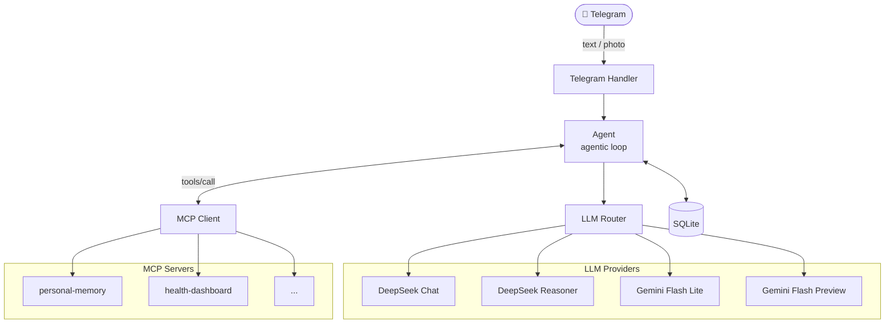

# Personal AI Agent

A lightweight Telegram bot that acts as a personal AI assistant. Written in Go — runs on a NAS, Raspberry Pi, or any small server. Bring your own API keys, no subscriptions.

## Features

- **Multi-model routing** — DeepSeek Chat as primary; Gemini 3.1 Flash Lite as automatic fallback on errors or rate limits; DeepSeek Reasoner for complex tasks; Gemini 3 Flash Preview for images
- **Image support** — send a photo (with or without caption) and it's routed automatically to the vision model
- **MCP tool support** — connects to any MCP-compatible server (HTTP/SSE), same `mcp.json` format as Claude Desktop; per-server `allowTools`/`denyTools` filtering
- **Persistent memory** — SQLite-backed conversation history with automatic session management
- **Context compaction** — auto-summarises old history to stay within token limits
- **Rich formatting** — Markdown converted to Telegram HTML; responses ≥ 4096 chars sent as `response.md`
- **Access control** — allowlist by chat ID + owner-only enforcement

## Requirements

- Go 1.24+ (or Docker)
- [Telegram Bot Token](https://t.me/BotFather)
- [DeepSeek API key](https://platform.deepseek.com)
- Gemini API key (optional — for fallback and image support)

## Quick start (NAS / Pi / server)

No source code needed — just pull the pre-built image:

```bash
# 1. Create the directory structure
mkdir -p my-assistant/config my-assistant/data
cd my-assistant

# 2. Download compose file
curl -O https://raw.githubusercontent.com/dzarlax/personal-assistant/main/docker-compose.yml

# 3. Create config files
curl -o config/config.yaml https://raw.githubusercontent.com/dzarlax/personal-assistant/main/config/config.yaml
curl -o config/system_prompt.md https://raw.githubusercontent.com/dzarlax/personal-assistant/main/config/system_prompt.md.example
curl -o config/mcp.json https://raw.githubusercontent.com/dzarlax/personal-assistant/main/config/mcp.json.example
curl -o .env https://raw.githubusercontent.com/dzarlax/personal-assistant/main/.env.example

# 4. Fill in secrets
nano .env

# 5. Start
docker compose up -d
docker compose logs -f
```

## Setup (from source)

```bash
cp .env.example .env
# fill in your API keys and Telegram token

cp config/mcp.json.example config/mcp.json
# configure MCP servers (optional)

cp config/system_prompt.md.example config/system_prompt.md
# personalise the assistant
```

**Get your Telegram chat ID:** send `/start` to [@userinfobot](https://t.me/userinfobot).

## Running

**Local:**
```bash
make run
```

**Docker (from source):**
```bash
make docker-up   # copies missing example files, then starts
make logs
```

Data is stored in `./data/conversations.db` (mounted as a volume in Docker).

## Project layout

```
.env                   # secrets — not in git
.env.example           # template
config/
  config.yaml          # model and routing config
  system_prompt.md     # personalise the assistant here
  mcp.json             # MCP servers — not in git
  mcp.json.example     # template
data/                  # SQLite DB — not in git
```

## Configuration

### `config/config.yaml`

All values support `${ENV_VAR}` substitution. Every model requires an explicit `base_url`.

```yaml
telegram:
  bot_token: ${TELEGRAM_BOT_TOKEN}
  allowed_chat_ids:
    - ${TELEGRAM_OWNER_CHAT_ID}
  owner_chat_id: ${TELEGRAM_OWNER_CHAT_ID}

models:
  default:
    provider: deepseek
    model: deepseek-chat
    api_key: ${DEEPSEEK_API_KEY}
    max_tokens: 4096
    base_url: https://api.deepseek.com
  reasoner:
    provider: deepseek
    model: deepseek-reasoner
    api_key: ${DEEPSEEK_API_KEY}
    max_tokens: 8192
    base_url: https://api.deepseek.com
  flash_lite:
    provider: gemini
    model: gemini-3.1-flash-lite-preview
    api_key: ${GEMINI_API_KEY}
    max_tokens: 2048
    base_url: https://generativelanguage.googleapis.com/v1beta/openai/
  multimodal:
    provider: gemini
    model: gemini-3-flash-preview
    api_key: ${GEMINI_API_KEY}
    max_tokens: 4096
    base_url: https://generativelanguage.googleapis.com/v1beta/openai/
```

### `config/mcp.json`

Same format as Claude Desktop. Supports custom headers for auth and per-server tool filtering.

```json
{
  "mcpServers": {
    "my-server": {
      "url": "${SERVER_URL}",
      "headers": {
        "Authorization": "Bearer ${TOKEN}"
      },
      "denyTools": ["dangerous_tool"],
      "allowTools": []
    }
  }
}
```

- `denyTools` — block specific tools, allow the rest
- `allowTools` — allow only listed tools, block the rest
- Omit both to allow all tools from the server

### `config/system_prompt.md`

Plain text or Markdown injected as system prompt on every request.

## Bot Commands

| Command | Description |
|---|---|
| `/clear` | Reset conversation context |
| `/compact` | Summarise and compress history manually |
| `/model` | Show current model |
| `/model reasoner` | Switch to DeepSeek Reasoner |
| `/model default` | Switch back to default |
| `/tools` | List connected MCP tools grouped by server |
| `/help` | Show help |

## LLM Routing

| Priority | Provider | When |
|---|---|---|
| 1 | Gemini 3 Flash Preview | Message contains an image |
| 2 | DeepSeek Reasoner | `/model reasoner` or reasoning keywords |
| 3 | DeepSeek Chat | Default |
| 4 | Gemini 3.1 Flash Lite | Primary unavailable (5xx / 429 / network) |

## Session Management

- History persists across restarts (SQLite)
- After **4 hours of inactivity**, a new session starts automatically — the last summary is carried over
- `/clear` does a full reset with no carry-over

## Architecture



See [CLAUDE.md](CLAUDE.md) for developer details and [docs/InitialSpec.md](docs/InitialSpec.md) for full spec.
